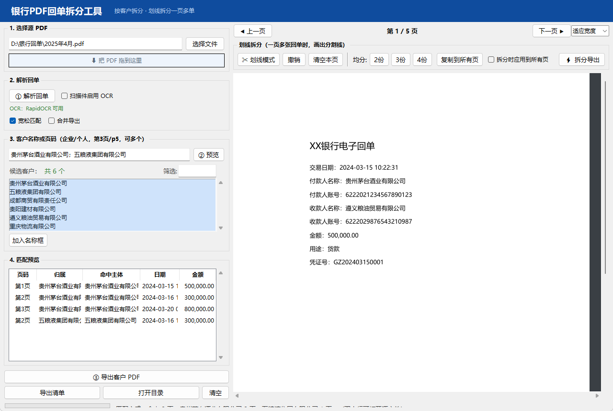

# 银行 PDF 回单拆分工具

从银行导出的 PDF 回单中，按客户名称拆分出指定客户的回单页面并另存为新 PDF；  
一页 A4 打印了 2/3 张回单时，还可在预览图上划线，把每张回单裁切为独立 PDF 页。  
适配各银行电子回单的常见字段版式（客户名称 / 户名 / 付款人 / 收款人 等）。



界面为「左侧功能区 + 右侧 PDF 预览」布局：选文件、解析、匹配、导出在左侧完成；  
右侧实时预览当前页，支持翻页、缩放与划线拆分。

## 快速开始

```bash
# 1. 安装依赖（需 Python 3.10+，且自带 tkinter）
pip install -r requirements.txt

# 2. 启动
python main.py
```

打包成免安装 exe：

```bat
build.bat        # 产物在 dist\ 下
```

## 使用流程

1. **选择源 PDF** —— 点「选择文件」，或直接把 PDF 拖进窗口
2. **① 解析回单** —— 后台提取文本并识别每页的客户名称（页数多时自动多进程加速）
3. **指定客户或页码** —— 在候选列表中点选（Ctrl/Shift 可多选），或在输入框直接输入；  
   也支持按页码提取：写 `第3页`、`p5` 或 `#7`，可与客户名混用、一次多个  
   （多个用 `,` `；` `、` 或换行分隔）
4. **② 预览匹配** —— 核对命中页码、日期、金额、摘要
5. **③ 导出 PDF** —— 每个客户生成一个 PDF；勾选「合并」则全部导成一个
6. 可选：**导出清单** 生成 CSV 对账表，**打开目录** 直达输出位置

## 关键行为说明

| 场景                 | 行为                              |
| ------------------ | ------------------------------- |
| 客户是「付款人」还是「收款人」    | 都能命中（每页提取全部主体）                  |
| 同一页既属于客户 A 又属于客户 B | A、B 各自的 PDF 都完整保留该页；勾选「合并」时才去重  |
| 输出文件已存在            | 默认自动加 `(1)(2)` 避让，可在界面取消        |
| PDF 加密             | 明确提示需先解除密码                      |
| PDF 是扫描件（无文本层）     | 勾选「扫描件启用 OCR」后自动识别（见下），未勾选则明确提示 |
| 名称含空格 / 全角 / 括号后缀  | 归一化后匹配（宽松模式可忽略括号内容）             |
| 标签与值分离的版式（「户 名」拆字、值在同行另一侧） | 常规正则抓不到时自动按词坐标位置解析，无需任何配置 |
| 输入 `第3页` / `p5` / `#7`  | 直接提取指定页码，不走名称匹配；可与客户名混用，页码超范围会在状态栏提示 |
| 划线拆分后导出 | 每段仍含文本层，可再次解析 / 按客户名匹配 |

## 划线拆分（一页多单）

有的银行回单一页 A4 打印 2 或 3 张回单，按页提取无法把它们分开。
此时在右侧预览区：

1. 点「**✂ 划线模式**」，在预览图上**单击**添加分割线（右键点线删除）
2. 或直接点「均分 2份 / 3份 / 4份」快速等分，再手动微调
3. 各页版式相同时，点「复制到所有页」或勾选「拆分时应用到所有页」
4. 点「**⚡ 拆分导出**」→ 每段回单裁切为一个独立 PDF 页
   （保留矢量与文本层，拆出后仍可搜索、可按客户名解析）

## OCR（可选）

银行导出的回单通常是带文本层的 PDF，直接可用；如果是扫描件（图片页），  
勾选「**扫描件启用 OCR**」即可自动识别，无需其他操作。

- 引擎：默认使用 **RapidOCR**（纯 pip 安装、自带中文模型、离线运行）
  ```bash
  pip install rapidocr_onnxruntime
  ```
  备选：已安装 Tesseract OCR（含 `chi_sim` 中文包）时自动使用。
- 界面会显示引擎状态（绿色「OCR：RapidOCR 可用」/ 橙色「未安装」）
- 仅对**无文本层的页面**执行 OCR，带文本层的页面不受影响、速度不变
- 渲染分辨率 200 DPI；OCR 逐页进行（约 1~3 秒/页），进度条实时显示
- 勾选状态会被记住，下次启动自动恢复
- 若 OCR 后仍无法识别（图片过于模糊），状态栏会明确提示

## 文件说明

| 文件                  | 作用                           |
| ------------------- | ---------------------------- |
| `main.py`           | GUI 主程序                      |
| `receipt_parser.py` | 解析核心（无 GUI 依赖，可独立测试 / 多进程调用） |
| `REVIEW.md`         | 代码审核报告（3 个严重缺陷及修复）           |
| `SPEC.md`           | 需求与设计规格                      |
| `build.bat`         | PyInstaller 打包脚本             |

## 已知限制

- 带文本层的 PDF 效果最好；扫描件依赖 OCR 识别率（清晰扫描件表现良好，  
  模糊/倾斜件可能识别不出，此时状态栏会提示）
- 客户名识别依赖回单上的标准字段标签（客户名称/户名/付款人/收款人等），  
  若银行版式使用生僻字段名，可能识别不到 —— 可手动输入客户名后用预览核对
